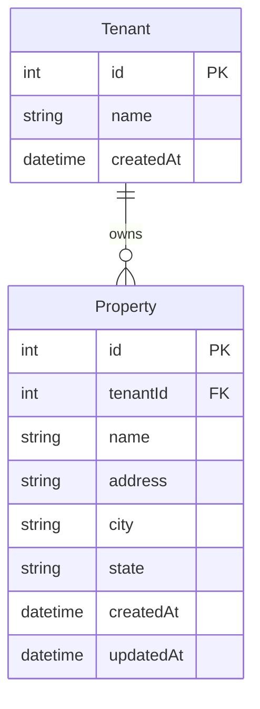
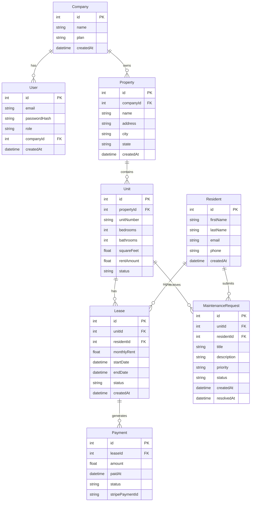

# Data Model — Visual Reference

Paste any diagram below into https://mermaid.live to see it rendered.
In VS Code: install the "Markdown Preview Mermaid Support" extension and open preview.
On GitHub: these render automatically in any .md file.

---

## Current Schema (This Project)

One organization owns many properties. Every query filters by `tenantId` so organizations
never see each other's data.



**Reading the relation:** `||--o{` means one Tenant has zero or more Properties.
A Property must belong to exactly one Tenant (the FK is required, not optional).

---

## Expanded Model (Hillpointe-Style)

A real property management system. Same patterns, more models and relations.



---

## Relation Key

| Symbol | Meaning |
|---|---|
| `\|\|` | Exactly one |
| `o\|` | Zero or one |
| `\|\|--o{` | One to zero-or-many |
| `\|\|--\|\|` | One to exactly one |
| `o{` | Zero or many |

---

## How Multi-Tenancy Maps to This

In this project:
- `Tenant` = the organization (the company using the app)
- Every `Property` row has a `tenantId` — it belongs to exactly one organization
- Every query filters by `tenantId` so orgs never see each other's data

In the Hillpointe model:
- `Company` = the organization
- Every `Property`, `Unit`, `Lease` traces back to a `companyId`
- A `User` (employee) belongs to a `Company` and their JWT carries `companyId` + `role`
- Same isolation pattern — just more tables in the chain

---

## Also: Prisma Studio (Live Visual for Your Actual DB)

```bash
cd app
npx prisma studio
```

Opens at `http://localhost:5555` — a live browser UI showing all your models, all your rows,
and all the relations between them. Click a Property row and see its linked Tenant.
Best tool for visualizing the real data while developing.
